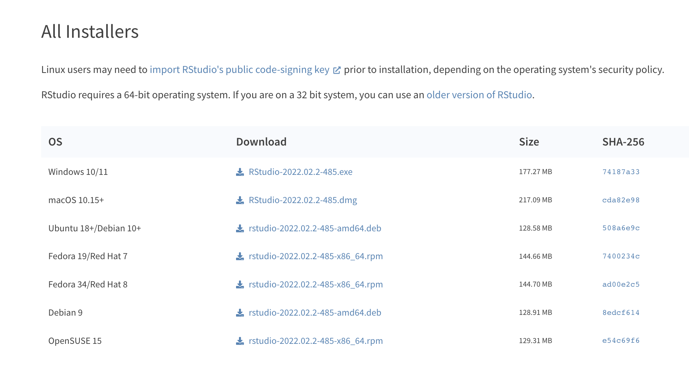

# Installation Guide

RAVE is written as an "R" package. To properly install RAVE, please carefully follow the instructions step-by-step. We found 90% installation issues are due to not following the instructions.

---

## System requirements & prerequisites

**System requirements**: 4 CPU cores with 8 GB RAM

RAVE is written in the programming language "R", it is necessary to download the *latest* version R into your computer. We also strongly recommend installing "RStudio", an integrated development environment to take the maximum benefit of RAVE features. This section will guide you to install the system software. Please click on the following links according to your operating systems.

* [MacOS](#macos)
* Windows
* Debian Linux (Ubuntu)


<!-- and its integrated development editor "RStudio" onto your computer. Correctly installing the following pre-requisites is necessary for RAVE to work properly. 

**Note:** RAVE requires the latest versions of R and RStudio to run properly. To avoid errors in the download process, if you already have R and RStudio on your computer, be sure they are updated to the most recent versions. -->

<!--- ### Windows

### Linux -->

### MacOS

<font size="4">**STEP 1: Install Homebrew**</font>

[Homebrew](https://brew.sh/) is a package manager that adds functions missing from the Apple operating system. It can be installed by copying and pasting the following line into your terminal (**note:** the terminal can be found through searching the applications folder on your computer): 

```sh
/bin/bash -c "$(curl -fsSL https://raw.githubusercontent.com/Homebrew/install/HEAD/install.sh)"
```

If you have not downloaded Homebrew to your computer before, you will be prompted with the following questions: 

```
==> Checking for `sudo` access (which may request your password)...
Password:
```

Enter your user's password (*the password won't be displayed into the screen as you type for security reasons*). Once you've finish typing, press the `RETURN` or `ENTER` key to proceed. 

```
==> This script will install:
... 
Press RETURN/ENTER to continue or any other key to abort:
```

Please press the `RETURN` or `ENTER` key to continue. 

<font size="4">**STEP 2: Add command `brew` to system search path**</font>

The terminal commands used to add homebrew to the path depend on your computer's CPU chip. Copy and paste the appropriate command lines into the terminal based on your computer's chip type. 

* **For M1 Chips** 
```sh
 echo 'eval "$(/opt/homebrew/bin/brew shellenv)"' >> ~/.zprofile
 echo 'eval "$(/opt/homebrew/bin/brew shellenv)"' >> ~/.profile
 echo 'eval "$(/opt/homebrew/bin/brew shellenv)"' >> ~/.bash_profile
```

* **For Intel Chips** 

```sh
 echo 'eval "$(/usr/local/bin/brew shellenv)"' >> ~/.zprofile
 echo 'eval "$(/usr/local/bin/brew shellenv)"' >> ~/.profile
 echo 'eval "$(/usr/local/bin/brew shellenv)"' >> ~/.bash_profile
```

<font size="4">**STEP 3: Use `brew` to install missing libraries**</font>

Open your system terminal, paste the following line into your terminal:

```sh
brew install hdf5 fftw pkg-config
```

This will install three libraries:

* `hdf5`: Shared library to access the universal HDF5 file format
* `fftw`: Fast-Fourier transform library required by signal processing code
* `pkg-config`: Package configuration helpers allowing R to find the two libraries above

<font size="4">**STEP 4: Install R**</font>

Download and install the latest version of R directly from the website: https://cran.r-project.org/bin/macosx/ Be sure to download the package that corresponds to your computer's OS version and CPU type. 

* For Intel Macs, download `R-X.X.X.pkg` 
* For M1 Macs, download `R-X.X.X-arm64.pkg` 

<font size="4">**STEP 5: Install RStudio Desktop**</font>

Download and install RStudio Desktop directly from the website: https://www.rstudio.com/products/rstudio/download/ Be sure to download the version that corresponds to your OS system. Refer to the following screenshot for guidance. 

 

<!--
#### Troubleshooting
Possible errors and their recommended fixes: 

* If you have multiple accounts on your computer but only one of them has homebrew installed, you may receive a **"the following directories are not writable by your user" error**. To resolve this error, you can change the ownership of the directories to the current user and make sure this user has write permission. 
* When executing step 2.1.1.4 (installing hdf5, fftw, and pkg-config), if you receive the error **"No available formula with the name "hdf5".**, there might bee an issue with the location of Homebrew. Try the following commands in your terminal: 

```sh
rm -rf "/usr/local/Homebrew/Library/Taps/homebrew/homebrew-core"
```
and then 
```sh
brew tap homebrew/core
```
-->
--- 

## Install RAVE

IMPORTANT: Before proceeding to rest of this section. Please make sure you have read and finished the previous section: "[System requirements & prerequisites](#system-requirements-prerequisites)".

**Download and Configure**

Open the RStudio application and click on the *Console* tab (if RStudio is set to default settings, this tab is usually located in bottom left panel of your screen). 

Copy and paste the following R command into the console to install RAVE and its dependence the online repository: 

```r
options(repos = c(ropensci = 'https://beauchamplab.r-universe.dev', 
                  CRAN = 'https://cloud.r-project.org'))
install.packages(c('rave', 'ravebuiltins'))
```

Copy and paste the following command onto the R console to update RAVE to the latest version (with bug fixes and new features): 

```r
rave::check_dependencies(nightly = TRUE)
```

Copy and paste the following command into the R console: 


```r
rave::finalize_installation(upgrade = 'ask')
```

This finalizing step will download the following additional parts:

* Template brain: (`N27`, `fsaverage`) for group-level electrode template mapping
* Demo subject data: for demonstration purposes

<!--#### Troubleshooting
* When updating RAVE, if you receive a "timeout of 60 seconds was reached" warning message, try switching to a faster network connection.-->

**Validate the Installation**

To check whether RAVE was properly installed, copy and paste the following commands
onto the console to start the program: 

```r
 rave::start_rave()
```

If installation was successful, a new web browser window should automatically open with the 
RAVE display. A screenshot is shown below: 

 

🎉 You have successfully downloaded RAVE! 

Now that you've completed installation, visit the following pages to start using RAVE! 

* [Starting RAVE](#starting-rave)
* [Upgrade RAVE](#upgrade-rave)
* [Change RAVE settings](#change-rave-settings) 


<!--
#### Troubleshooting 
** The RAVE data should be located [default location]. If located elsewhere on the window, copy and paste the following command onto the console to set the data directory to the correct location: 
```r
 rave::rave_options()
```
-->

--- 

## Upgrade RAVE

RAVE is actively under development with new features and bug fixes. To enjoy the new features, RAVE has built-in function that allows to update itself directly from the following R command:

```r
 rave::check_dependencies(nightly = TRUE)
```

**Note:** When re-updating, a pop-up might appear asking if you want to re-install the N27 template brain. Simply choose no.


## Troubleshooting


