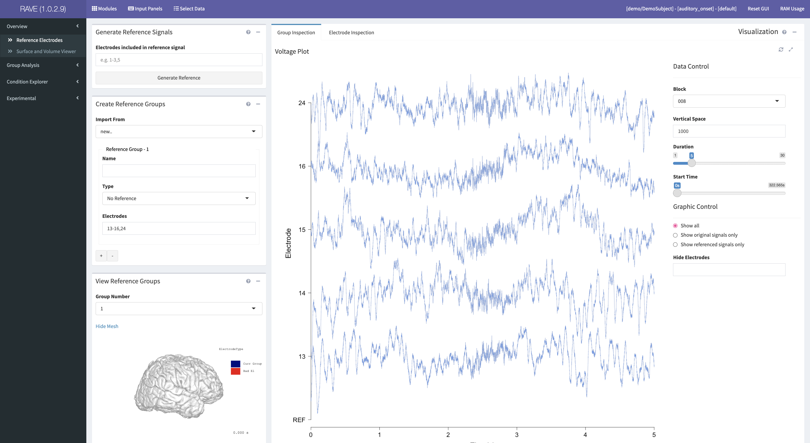
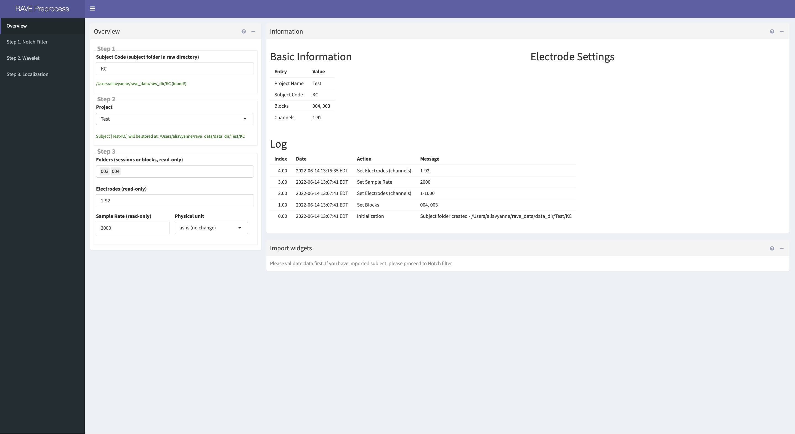
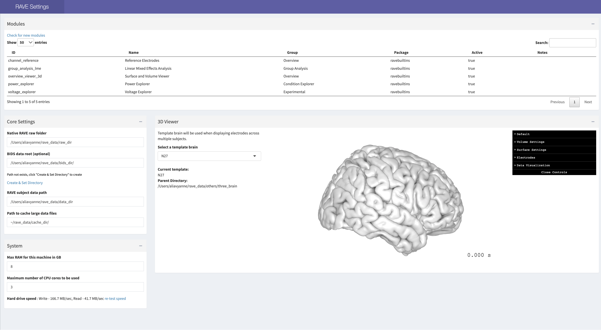

# Get Started

Now that you've successfully installed RAVE, review the following instructions to get started using it.  

--- 

## Overview of RAVE Structure 
<font size="4">**Main Application**</font>

The **main application** enables you to analyze your cleaned iEEG data. 

Access it by copying and pasting the following command into the RStudio console: 
```r 
 rave::start_rave() 
```
 

<font size="4">**Preprocess**</font>

The **preprocess** application enables you to load your iEEG data into RAVE and prepare it for analysis in future modules. 

Access it by copying and pasting the following command into the RStudio console: 
```r 
 rave::rave_preprocess() 
```

It includes four sections: 
* **Overview:** Allows you to import your data into RAVE and set configurations (e.g. which electrodes you want to use, file type, where to store cleaned data)
* **Notch Filter:** Allows you to 
* **Wavelet:** Allows you to 
* **Localization** Allows you to 



<font size="4">**Options**</font>

The **options** application enables you to edit RAVE settings. To access options, copy and paste the following command into the RStudio console: 

```r 
 rave::rave_options()
```

* **Modules:** Summary of all RAVE modules
* **Core Settings:** Allows you to change where RAVE data is stored.  
* **System:** Allows you to change RAM and number of CPU cores RAVE can use to alter speed at which data is read 
* **3D Viewer:** Allows you to change which downloaded brain data to use as the template brain for electrode template mapping; the default template brain is `N27`. 

 

## Starting and Closing RAVE

<font size="4">**Starting RAVE**</font>

*Note:* you must quit and restart RStudio if you have just downloaded or updated RAVE in order for the application to start successfully.

After restarting RStudio, copy and paste the following command into the RStudio console to open RAVE: 

```r
 rave::start_rave()
```

RAVE will display in a new web browser (Google Chrome is recommended for optimal use). 

<font size="4">**Closing RAVE**</font>

To completely close the RAVE server: 

1). Click the red stop sign in the bottom left panel of RStudio (refer to the screenshot below to find the stop sign). 

 

2). Quit the RStudio application. If asked whether you want to **Save workspace image?**, click no.  

**Note:** Closing the RAVE display tab on your web browser will only close the display, not the actual RAVE server. 

---

<!-- ## Change RAVE Settings
To access and change RAVE settings, copy and paste the following command into the RStudio console: 

```r 
 rave::rave_options()
```

* **Modules:** Summary of all RAVE modules
* **Core Settings:** Allows you to change where RAVE data is stored.  
* **System:** Allows you to change RAM and number of CPU cores RAVE can use to alter speed at which data is read 
* **3D Viewer:** Allows you to change which downloaded brain data to use as the template brain for electrode template mapping; the default template brain is `N27`. 

--> 

**Note:** In general, you must stop processes that are currently being executed by the console before trying to initiate another command. To do this, click the red stop sign on the bottom left panel of RStudio. For example, if you have just opened RAVE and wish to update the application, click the red stop sign first. 
