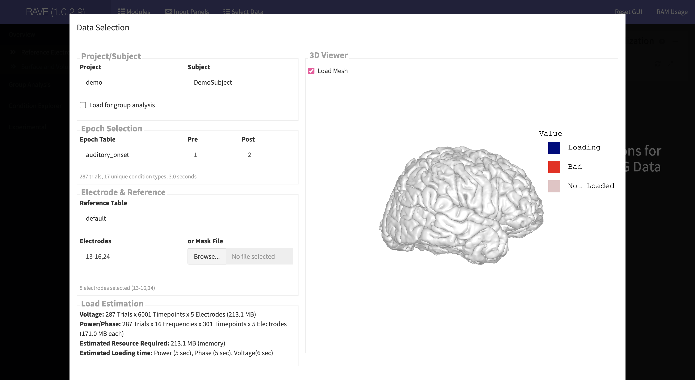
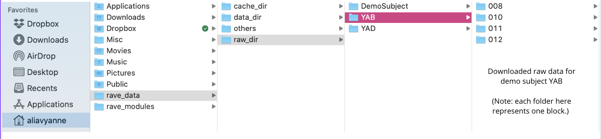

# Installation Guide

RAVE is written as an "R" package. To properly install RAVE, please carefully follow the instructions step-by-step. We found that the vast majority of installation issues are due to not following the instructions. 

[Hardware Requirements]{.underline}

-   Minimal requirement: 4 CPU cores with 8 GB RAM
-   Recommended: 8+ CPU with 32+ GB RAM

[System Library Prerequisites]{.underline} 

-   [MacOS](#macos)
-   Windows
-   Debian Linux (Ubuntu)

## System Prerequisites {#system-prerequisites}

RAVE is written in the programming language "R", so it is necessary to download the *latest* version of R on the computer. It is strongly recommended to install "RStudio", an integrated development environment, in order to easily utilize RAVE features. This section will guide the installation of these and other prerequisites. Please click on the following links according to your operating systems.

-   [MacOS](#macos)
-   Windows
-   Debian Linux (Ubuntu)

```{=html}
<!-- and its integrated development editor "RStudio" onto your computer. Correctly installing the following pre-requisites is necessary for RAVE to work properly. 

**Note:** RAVE requires the latest versions of R and RStudio to run properly. To avoid errors in the download process, if you already have R and RStudio on your computer, be sure they are updated to the most recent versions. -->
```
```{=html}
<!--- ### Windows

### Linux -->
```
### MacOS {#macos}

<span id="step-1-install-homebrew" class="font-5 underline strong">[STEP 1: Install Homebrew]</font>

*(Note: if you have downloaded **Homebrew** in the past, please skip Step 1 and 2 and jump to the [Step 3](#step-3-use-brew-to-install-missing-libraries).)*

[Homebrew](https://brew.sh/) is a package manager that adds system libraries missing from the Apple operating system. It can be installed by copying and pasting the following line into the terminal (**note:** the terminal can be found through searching the applications folder on the computer):

``` sh
/bin/bash -c "$(curl -fsSL https://raw.githubusercontent.com/Homebrew/install/HEAD/install.sh)"
```

If this is the first time installing Homebrew, the following questions might be prompted:

    ==> Checking for `sudo` access (which may request your password)...
    Password:

Enter your user's password (*the password won't be displayed into the screen as you type for security reasons*). Once finished, press the `RETURN` or `ENTER` key to proceed. After, the following message should display: 

    ==> This script will install:
    ... 
    Press RETURN/ENTER to continue or any other key to abort:

Please press the `RETURN` or `ENTER` key to continue. Note that this process can take several minutes. 

[[STEP 2: Add command "brew" to system search path]]{.font-5 .underline .strong}

The terminal commands used to add homebrew to the path depend on your computer's CPU chip. Copy and paste the appropriate command lines into the terminal based on your computer's chip type. If you don't know the CPU type, click the `` icon on the top-right, and choose `About This Mac`.

-   **For M1 Chips**

``` sh
 echo 'eval "$(/opt/homebrew/bin/brew shellenv)"' >> ~/.zprofile
 echo 'eval "$(/opt/homebrew/bin/brew shellenv)"' >> ~/.profile
 echo 'eval "$(/opt/homebrew/bin/brew shellenv)"' >> ~/.bash_profile
```

-   **For Intel Chips**

``` sh
 echo 'eval "$(/usr/local/bin/brew shellenv)"' >> ~/.zprofile
 echo 'eval "$(/usr/local/bin/brew shellenv)"' >> ~/.profile
 echo 'eval "$(/usr/local/bin/brew shellenv)"' >> ~/.bash_profile
```

[[STEP 3: Use brew to install missing libraries]]{#step-3-use-brew-to-install-missing-libraries .font-5 .underline .strong}

Open the system terminal, paste the following line and press `return` key:

``` sh
brew install hdf5 fftw pkg-config
```

This command installs the following three libraries:

-   `hdf5`: Shared library to access the universal HDF5 file format
-   `fftw`: Fast-Fourier transform library required by signal processing code
-   `pkg-config`: Package configuration helpers allowing R to find the two libraries above

[[STEP 4: Install R]]{.font-5 .underline .strong}

Download and install the **latest** version of R directly from the website: <https://cran.r-project.org/bin/macosx/> Be sure to download the package that corresponds to the computer's OS version and CPU type. If R has been installed, we highly recommend updating to the latest version.

-   For Intel Macs, the R installer name should look like `R-X.X.X.pkg`
-   For M1 Macs, the R installer name should look like `R-X.X.X-arm64.pkg`

[[STEP 5: Install RStudio Desktop]]{.font-5 .underline .strong}

Download and install RStudio Desktop directly from the website: <https://www.rstudio.com/products/rstudio/download/> Be sure to download the version that corresponds to the OS system. If RStudio is already downloaded, simply ensure it is updated to the *latest* version. Refer to the following screenshot for guidance.

](static/image/RStudioScreenshot.png)

### Install external programs (`dcm2niix`, `FreeSurfer`, `FSL`, `AFNI`)

The following external programs are used by RAVE in the Surface Reconstruction and Electrode Localization module, and so it is **necessary** to download them now.

> Note: If trying to download `FreeSurfer`, `FSL`, or `AFNI` on a Mac, it is necessary to download and install `Xquartz` release from <https://www.xquartz.org>. Xquartz enables applications that were not designed for MacOS to still run on Mac computers.

1. `dcm2niix`: A package used to convert DICOM image files into the `NifTi-1` file format. Visit the [GitHub repository] (<https://github.com/rordenlab/dcm2niix/blob/master/README.md#install>). There are various ways to install based on the computer's operating system.

2. `FreeSurfer`: A package used for the analysis and visualization of neuroimaging data. RAVE uses it to reconstruct cortical surfaces based on a subject's MRI scan. Visit the [`FreeSurfer` wiki](https://surfer.nmr.mgh.harvard.edu/fswiki/rel7downloads). There are various ways to install based on the computer's operating system.

> Note: When RAVE invokes FreeSurfer, an error may arise indicating that the FreeSurfer license file was not found. To avoid errors down the road, visit <https://surfer.nmr.mgh.harvard.edu/fswiki/License>. Follow the instructions to fill out a form requesting the **free license key,** recieve a license.txt file via email, and then place that file in the appropriate folder.

3. `FSL` OR `ANFI`: `FSL` is a library used for the analysis of fMRI, MRI, and DTI brain images. `ANFI` (Analysis of Functional NeuroImages) is a software used for the analysis and display of MRI data. Pick either one to download; RAVE will use the selected program to align a CT scan to a MRI image.

* `FSL`: Visit the [`FSL` Website](https://fsl.fmrib.ox.ac.uk/fsl/fslwiki/FslInstallation). Fill out the form to request a **FSL license** and specify the computer's operating system. Instructions will then be given for the selected system. Pay particular attention to any notes given in the instructions (e.g. administrative privileges, Mac Monterey users).

* `AFNI`: Visit the [`AFNI` Website](https://afni.nimh.nih.gov/pub/dist/doc/htmldoc/background_install/main_toc.html). Select the appropriate link based on the computer's operating system. In the resulting download guide, please skip over steps to install Homebrew and R as installing RAVE already necessitated doing so. (The most important step is "Install AFNI".) When following the final step, "Evaluating Setup," any warnings regarding an old X version, login shell, matplotlib, or insufficient data for AFNI bootcamp can be ignored as RAVE does not require these configurations.

## Install RAVE

> Important: Before proceeding to rest of this section. Please make sure you have read and finished the previous section: "[System prerequisites](#system-prerequisites)".

**Step #1: Download and Configure**

Open the RStudio application and click on the *Console* tab. If RStudio adopts the default settings, this tab should be located in bottom-left.

> Important: Please do NOT confuse an R command with a shell command. When running R command, please open `RStudio` and use the `Console` tab to run. If you direct copy the R scripts into system shell terminals, the script will fail!

Copy and paste the following R command into the RStudio console to install RAVE and its dependencies from online repositories:

``` r
options(repos = c(ropensci = 'https://beauchamplab.r-universe.dev', 
                  CRAN = 'https://cloud.r-project.org'))
install.packages(c('rave', 'ravebuiltins', 'ravedash'))
```

Note that whenever you see a blue ` >` in the bottom left of the console, the entered code has finished running. Next, copy and paste the following command into the RStudio console to update RAVE to the latest version (with bug fixes and new features):

``` r
rave::check_dependencies(nightly = TRUE)
```

Finally, execute the following R command to download extra data and templates:

``` r
rave::finalize_installation(upgrade = 'always')
```

Note that this step can take a few minutes and will download the following additional parts:

-   Template brain: (`N27`, `fsaverage`) for group-level electrode template mapping
-   Demo subject data: for demonstration purposes
-   Built-in modules and pipelines

```{=html}
<!--#### Troubleshooting
* When updating RAVE, if you receive a "timeout of 60 seconds was reached" warning message, try switching to a faster network connection.-->
```
**Step #2: Validate the Installation**

To check whether RAVE has been properly installed, execute the following R command to start the program.

``` r
rave::start_rave()
```

If installation was successful, a new web browser window should automatically open with the RAVE display. A screenshot is shown below:



🎉 You have successfully downloaded RAVE!

Now that installation was completed, visit the following pages to start using RAVE!

-   [Starting RAVE](#starting-rave)
-   [Upgrade RAVE](#upgrade-rave)
-   [Change RAVE settings](#change-rave-settings)

## Download demo data

> Note: data can not be installed while RAVE is running. Please click the red stop sign in the top right of the console to close the server before following the steps below. 

To gain familiarity with RAVE, it is recommended to try the built-in demo data in various modules. By default, RAVE already has a DemoSubject whose raw data has already been imported. However, you can also download other demo subjects by copying and pasting the following command into the RStudio console:

``` r
rave::download_sample_data("subject_code")
```

Substitute "subject_code" with one of the available demo subjects: `KC`, `YAB`, `YAD`, `YAF`, `YAH`, `YAI`, `YAJ`, and `YAK`.

For example, to download subject YAB, use the following command:

``` r
rave::download_sample_data("YAB")
```

Note that downloaded demo data will be stored in the `raw_dir` folder of the `rave_data` folder in your home directory. Within `raw_dir`, each subject's data is stored in its own folder (e.g. YAB's data will be stored in the YAB folder in `raw_dir`). Refer to the following screenshot for clarity.



## Upgrade RAVE {#upgrade-rave}

RAVE is actively under development with new features and bug fixes. To enjoy the new features, RAVE has a built-in function to update itself when the following R command is entered into the console. Using this command regularly is recommended to ensure the newest version of RAVE is running. 

``` r
 rave::check_dependencies(nightly = TRUE)
```

> When upgrading RAVE in RStudio, a pop-up dialogue might appear asking if you want to re-install the N27 template brain or pipeline modules. Simply choose "yes".

> Please make sure you have access to the internet when upgrading.

## Troubleshooting

Possible errors during the installation of RAVE and their solutions:

> **Error:** "Can't update lock in /usr/local/var/homebrew/locks".

This error could occur if thee computer has multiple accounts, and the current active account does not have the right to manage brew libraries. Please login with account that has the privilege to manage HomeBrew and use that account to install.

> **Error:** "No available formula with the name <xxxx>".

There might be an issue with your Homebrew: it cannot find proper formula (recipe needed to brew libraries). Please try reseting the brew repository by:

``` sh
rm -rf "/usr/local/Homebrew/Library/Taps/homebrew/homebrew-core"
brew tap homebrew/core
```

````{=html}
<!-- 
** The RAVE data should be located [default location]. If located elsewhere on the window, copy and paste the following command onto the console to set the data directory to the correct location: 
```r
 rave::rave_options()
```
-->
````