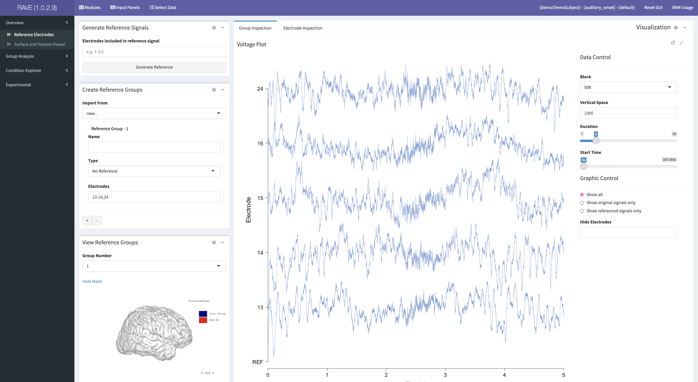
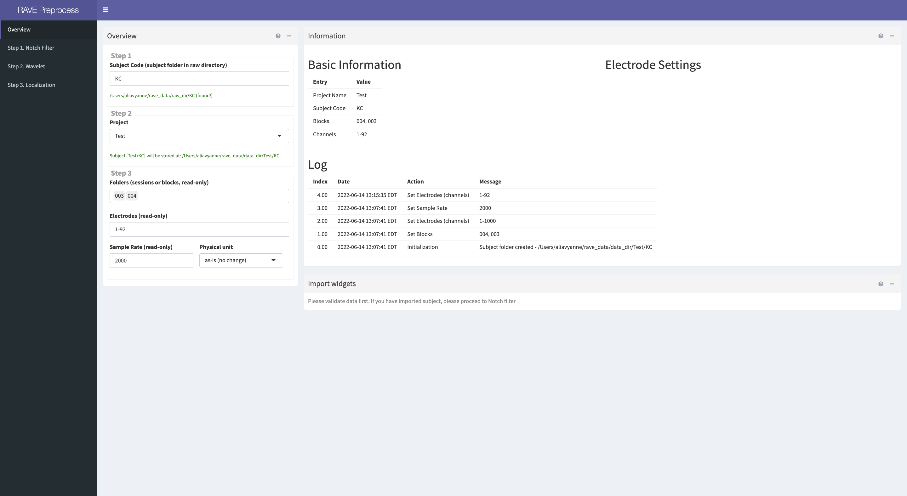
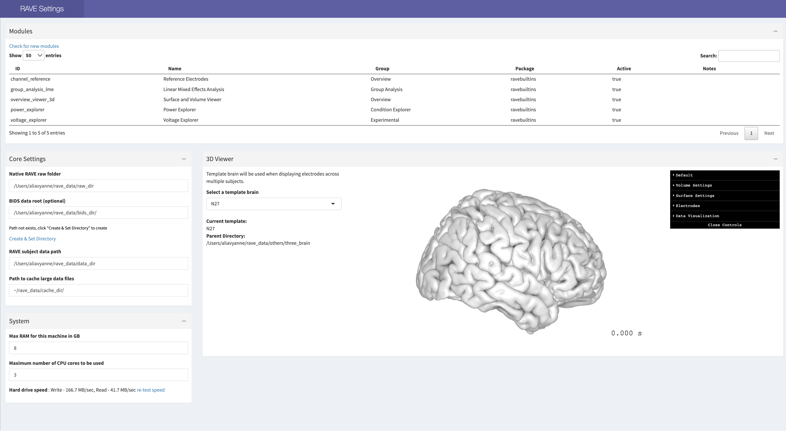

# Get Started

Now that RAVE has successfully been installed, review the following instructions to get started using it.  

--- 

## Overview of RAVE Structure 
<font size="4">**Main Application**</font>

The **main application** allows for the analysis of cleaned iEEG data. 

Access it by copying and pasting the following command into the RStudio console: 
```r 
 rave::start_rave() 
```
 

<font size="4">**Preprocess**</font>

The **preprocess** application allows for the importing of iEEG data into RAVE and preparing it for analysis in future modules. 

Access it by copying and pasting the following command into the RStudio console: 
```r 
 rave::rave_preprocess() 
```

It includes four sections: 
* **Overview:** 
* **Notch Filter:** 
* **Wavelet:** 
* **Localization** 



<font size="4">**Options**</font>

The **options** application allows for the editing of RAVE settings. To access options, copy and paste the following command into the RStudio console: 

```r 
 rave::rave_options()
```

* **Modules:** Summary of all RAVE modules
* **Core Settings:** change where RAVE data is stored.  
* **System:** change RAM and number of CPU cores RAVE can use to alter speed at which data is read 
* **3D Viewer:** change which downloaded brain data to use as the template brain for electrode template mapping; the default template brain is `N27`. 

 

## Starting and Closing RAVE

<font size="4">**Starting RAVE**</font>

*Note:* it is necessary to quit and restart RStudio if RAVE has just been downloaded or updated, in order for the application to start successfully.

After restarting RStudio, copy and paste the following command into the RStudio console to open RAVE: 

```r
 rave::start_rave()
```

RAVE will display in a new web browser (Google Chrome is recommended for optimal use). 

<font size="4">**Closing RAVE**</font>

To completely close the RAVE server: 

1). Click the red stop sign in the bottom left panel of RStudio (refer to the screenshot below to find the stop sign). 

 

2). Quit the RStudio application. If asked whether to **Save workspace image?**, click no.  

**Note:** Closing the RAVE display tab on the web browser will only close the display, not the actual RAVE server. 

---

<!-- ## Change RAVE Settings
To access and change RAVE settings, copy and paste the following command into the RStudio console: 

```r 
 rave::rave_options()
```

* **Modules:** Summary of all RAVE modules
* **Core Settings:** Allows you to change where RAVE data is stored.  
* **System:** Allows you to change RAM and number of CPU cores RAVE can use to alter speed at which data is read 
* **3D Viewer:** Allows you to change which downloaded brain data to use as the template brain for electrode template mapping; the default template brain is `N27`. 

--> 

**Note:** In general, it is necessary to stop processes that are currently being executed by the console before trying to initiate another command. To do this, click the red stop sign on the bottom left panel of RStudio. For example, if RAVE has just been opened and one wants to open the preprocessing application next, click the red stop sign first. 
