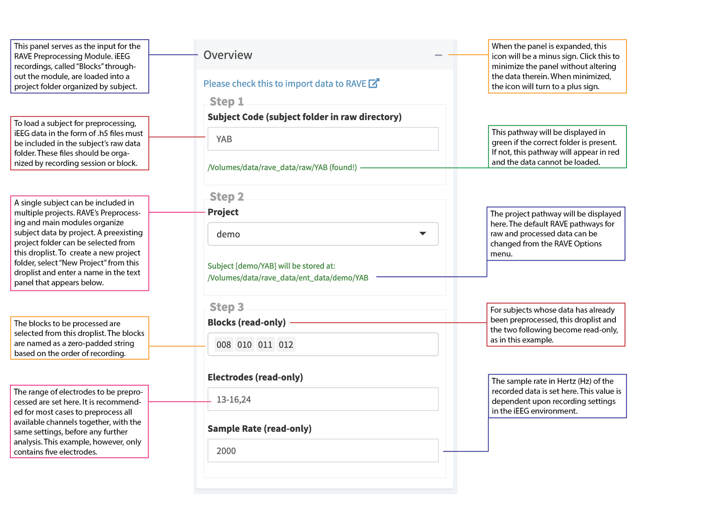

# Get Data into RAVE

<div class="edit-comment">
~~Now that you have installed and gotten started with RAVE, you can proceed to importing your iEEG data into the software so that it can be preprocessed and used in future modules.~~

It is non-trivial to import data into RAVE. Luckily, RAVE supports multiple universal file conventions such as HDF5, EDF(+), BrainVision, and Matlab data formats. With more and more data formats supported, RAVE will become less dependent on 3rd-party softwares.

This chapter will guide you through the following topics:

* File hierarchy and specification
* Overview: Voltage data
  * Import Matlab/HDF5 file per electrode per block
  * Import One Matlab/HDF5 file per session block
  * Import Single EDF(+) file per block
  * Import Single BrainVision file per block
* Overview: Neuro-Imaging data
  * Import MR imaging data
  * Import FreeSurfer data
  * Import CT data

</div>

## File hierarchy and specification

There are two major data folders in RAVE. One contains the raw, unprocessed data such as analog traces, MRI/CT scans. The other stores processed data which is self-contained and portable. Both data folders are located at your home directory. To get the locations of these two folders, please launch a blank RAVE session:

```r
rave::start_session()
```

<span class="edit-comment">TODO: Add a figure with captions showing where to find these settings</span>


<span class="edit-comment">TODO Also add a walk-through to each folders</span>

This next section focuses on how to organize the raw data folder. The goal is to import the electrophysiological data into RAVE.

## Overview: Voltage data

RAVE supports various of data formats such as HDF5, EDF(+), BrainVision, and Matlab, etc... Before discussing about these data formats, let's start from the general workflow with the demo data that has already been installed. (If you haven't downloaded demo data, please see here for detailed instructions)

Let's launch a blank RAVE session:

```r
rave::start_session()
```

In the sidebar, open `Import Signals > Native Structure` .....


<!-- Latex PDF use: new page here, no HTML effect -->
\newpage

### Format 1


<!-- 
## Importing demo data

Launch the RAVE preprocessing module by copy and paste the following command into the RStudio console: 

```r 
 rave::rave_preprocess()
```

The Preprocessing module will then open in a browser window, allowing you to see the Overview page. The Overview page is where you will import or load your data into RAVE. It consists of three panels. 
* **Overview:** this is where inputs and configurations will be specified 
* **Information:** a summary of the inputs and configurations is shown here. 
* **Import Widgets** 

Proceed to the overview panel to specify these inputs and configurations. 

### Step 1: Select Subject
Enter the code for the demo subject whose iEEG data to import into RAVE. Note that a subject's data should be stored in its own folder within the raw directory (`raw_dir` folder) within the`rave_data` folder. 

E.g. to select demo subject KC, enter "KC" and the following message should result, indicating the subject has been found: /Users/your_home_directory/rave_data/raw_dir/KC (found!)

### Step 2: Select Project or Create New One 
This step allows for the specification of where to storee the cleaned data. To create a new project, select "New Project" from the drop down menu and indicate the desired project name. Note that by default, this project folder will be created within the data directory (`data_dir`) within `rave_data`, with a new folder for the subject. 

E.g. to store demo subject KC in a new project called "Test", the following message should result: 
Subject [Test/KC] will be stored at: /Users/your_home_directory/rave_data/data_dir/Test/KC

Then, click "create subject" to proceed. 

### Step 3: Validate Data 
In this step, specify your desired electrode (aka channel) options: 

<!-- // add note that once you notch filter these, you can not change them 

* **Folders:** Each folder corresponds to a block, aka a period or session of continuous electrode recording. Select the blocks that correspond to the trials to analyze. (E.g. for KC, you could select blocks 003 and 004.) 

* **Electrodes:** Indicate the electrodes to analyze. Note that it is recommended that you run the preprocessing steps on all electrodes at once. (E.g. for KC, you should indicate 1-92.) 

* **Sample Rate:** Indicate the sample rate of iEEG recording equipment; this value will determine the rate at which the preprocessing will be run. For demo subjects, indicate `2000.` 

* **Physical Unit:** Indicate the units to use to measure voltage. Demo data can be kept at the default `as-is (no change)` option. 

* **File Format:** RAVE currently supports six file formats for iEEG data. Demo data is stored using `.mat/.h5 files`, in which one file represents one electrode in a given block. (For guidance when selecting a file format, RAVE will briefly describe the format and display a sample organization of the directory.) 

Click the **Check Subject** button to proceed. (Note: this process can take a few minutes; progress will be displayed via pop-ups in the bottom right.) 

Click the **Start Import** button to proceed. (Note: this process can take a few minutes.)

The demo subject has successfully been imported into RAVE. Proceed to the preprocessing modules for further cleaning of this data. 

The following screenshot summarizes the data loading process: 
 
--> 

## Importing Your Own Data
If ready to start using RAVE with lab data, follow the steps below to import the data so that it can be preprocessed and used in future modules.   

### Organizing Your Directories 
<!-- This is a work in progress ... not 100% sure how this would be done --> 
```r 
 rave::archive_subject
```