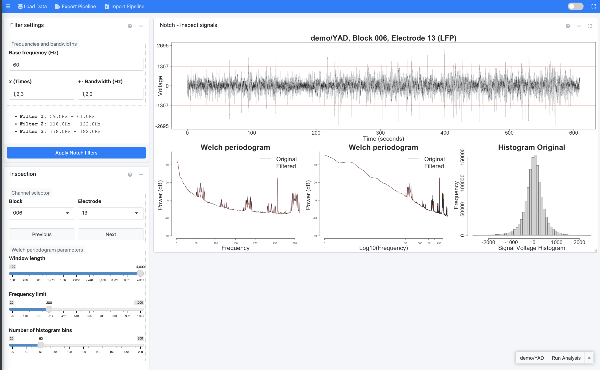

# Preprocessing 
<!-- will merge with 03 import data section that is already written--> 

## Part One 
<!-- not sure what would be the best name for these headers yet; want to imply the first four are sequential --> 
<!-- need to specify what type of data is being imported -- iEEG recording info) --> 

 **Step #1: Import Signals** 

<!-- have labeled screenshot for each step similar to the one in 04-preprocessing--> 
Now that you have installed and gotten started with RAVE, you can proceed to importing your iEEG data into the software so that it can be preprocessed and used in future modules.

**Step 1.1:** Select project & subject

First, use the drop down menu to **specify which project** you want the cleaned subject data to be stored in. If you wish to create a new project, select "New Project" from the drop down menu and indicate your desired project name. Note that by default, this project folder will be created within the `rave_data` folder of the data directory (`data_dir`), in a new folder for your subject. 

Next, use the drop down menu to **select the code for the subject** whose data you want to import. Note that a subject's data should be stored in its own folder within the raw directory (`raw_dir` folder) within the`rave_data` folder. 

Click the **"Create Subject"** button to proceed to the next step. 

**Step 1.2:** Format & session blocks

RAVE defines a block/session as a period of continuous electrode recording. Here, you should first **select the blocks** that correspond to the trials you want to analyze. 

Note that when you select a block, a preview of the files it contains will pop-up to the right. This feature helps you check that the way you've stored your data is consistent with the file type you've selected. 

Then, **specify the file format** your iEEG data is stored in. RAVE currently supports four file formats: 

* .mat/.h5 file per electrode per block 
* single .mat/.h5 file per block 
* single EDF(+) file per block 
* single BrainVision file 

Note that when you select a format from the drop down, a brief description of the specific format will pop-up underneath the menu. For more information on these file types, visit the Q&A at [Importing Data](#importing-data)

<!-- maybe cross link each of these file formats to a question in the Q&A session so that if someone wants to learn more about a given file format, they can do so without cluttering up this section. or should i give the description right next to the bullet point --> 

**Step 1.3:** Channel information

RAVE equates a channel to an electrode. Set the following specifications for your channels:  

<!-- this isn't exactly true, so come back later to fix definition --> 

* **Data file:** 

* **Channel numbers:** Indicate the electrodes you wish to analyze. It is recommended that you run the preprocessing steps on all electrodes at once. Note that RAVE can automatically detect potential electrodes based on the specified blocks and file type; this suggestion is displayed at the bottom of the panel. 

* **Physical unit:** Indicate the units you wish to use to measure voltage.

* **Sample rate:** Indicate the rate of your iEEG recording equipment; this value will determine the rate at which the preprocessing will be run.

Now, select the **Validate & Import** button to validate your data. A pop-up will soon appear asking if you are ready to import your data. Please double check all the information you entered is correct, and then select the **Import Data** button to proceed. You will see a progress bar in the bottom left corner. 

<!-- in this paragrraph, make sure to add a note about the skip validate & import button / when it can be used --> 

A pop-up will soon appear indicating that you have successfully imported your subject data into RAVE! You can now use the menu on the left side of the screen to select the first preprocessing module, notch filter. 

 **Step #2: Notch Filter** 
<!-- add very brief description of what this section is for first; essentially it filters out extra noise without disruption to the rest of the signal. it does this by minimizing signals within a narrow bandwidth; the rest of the signal is not disrupted because it's not in the bandwidth. a bandwidth is a range of frequencies within a band. a common reason for applying it is because EEG recording setups often include an amplifier. 
AC power grid in US is 60 Hz, issue is the EEG recording equipment will pick up on that and we don't want those signals because they're not from the brain, they're external. so the idea is to remove that data. stopband = a band of frequencies that are reduced by a filter. width is essentially the amount of frequencies --> 
<!-- how do you create notch filter? probably put brief explanation here and then have a question in Q&A where they can learn more with any outside links. "The easiest is to create a notch filter, which basically involves taking the FFT of the signal, zeroing out the Fourier coefficients at/around 50 Hz (best to use gentle slopes to minimize introducing artifacts resulting from sharp edges), then taking the inverse FFT."--> 
<!-- "calculation of multiples of a base frequency" -- why do you need to do multiples? --> 

**What is a notch filter?** A notch filter blocks a given frequency or a narrow range of frequencies (aka a "bandwidth") from a signal without affecting the rest of that signal. It is often used to minimize line noise interference in raw iEEG data, which helps ensure that future analyses only consider actual brain data. A common source of this interference is the amplifier used in recording set-ups to convert electrode signals into a form readable by the computer. This interference is commonly introduced at 60 Hz, since that is the standard frequency used in the North American electrical grid system. 

To apply the notch filter to your data, follow the steps below. 

<!-- clarify block --> 

Begin in the **Data Selection** window to <u> specify which data you want to perform the notch filter on </u>. Use the drop down to indicate the desired project and subject. Note that you can press the **Sync from [Import LFP] module** link to automatically select the project and subject that you just imported in the Import Signals module. 

<!-- make sure to add in the Q&A what happens if you get errors in this case --> 

Proceed by selecting the **Load Subject** button. A new screen will load with three panels: Filter Settings, Inspection, and Notch. Refer to the following screenshot for guidance. 

**Filter Settings:** Begin my indicating your desired configurations for the **filter(s)**.

* <u>Base frequency</u> refers to the frequency introduced by the amplifier that you want to remove. By default, this is set as 60 Hz as that is the frequency introduced by most iEEG amplifiers.  

* <u>x Times</u> sets the number of filters you want to use. 

* <u>+- Bandwidth (Hz)</u> refers to how wide you wish to make each filter; a higher number will remove a wider range of frequencies whereas a lower number will remove a narrower range of frequencies. You should enter one number for each filter you have. By default, this value is set to 1,2,2 -- in other words, your filters will remove the bandwidths **59 - 61 Hz** (aka 60 Hz +/- 1), **118 - 122 Hz** (aka 120 Hz +/- 2), **178 - 182 Hz** (aka 180 Hz +/- 2) respectively. 

<!-- specify why they may wish to do this // how exactly do you wish to set it to this --> 

Based on these configurations, the bottom of the panel will automatically display a summary of how many filters you have and the bandwidths each will remove. 

Click the blue **Apply Notch Filters** button to apply the filters to your data. 

**Inspection:** Controls settings of the **notch** <!-- clarify what a notch itself is --> 

Use the <u>block</u> and <u>electrode</u> drop down menus to select the data you wish to display in the Notch: Inspect Signals panel located on the right half of the screen. You can use the `previous` and `next` buttons to easily switch between which electrode you're viewing within a selected recording session.  

* <u>+- Window length</u> refers to 
* <u>+- Frequency limit</u> refers to 
* <u>+- Number of histogram bins</u> refers to 

**Notch: Inspect Signals:** Displays ***raw and filtered iEEG signals** for each channel whose data was imported 

<!-- Refer to the following screenshot for further guidance. label purpose of each section --> 
<!-- note: they need to specify the configurations for the notch filter, and then --> 

 **Step #3: Wavelet** 
Wavelet transform 

 **Step #4: Reference Signals** 
Common average referencing 

--- 

## Part Two

 **Surface Registration Localization** 

--- 

## Part Three

 **Generate Epoch** 
