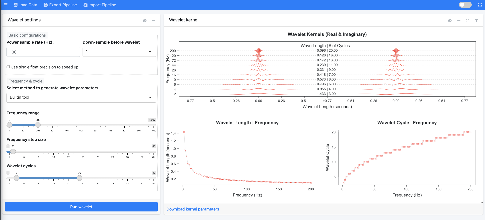
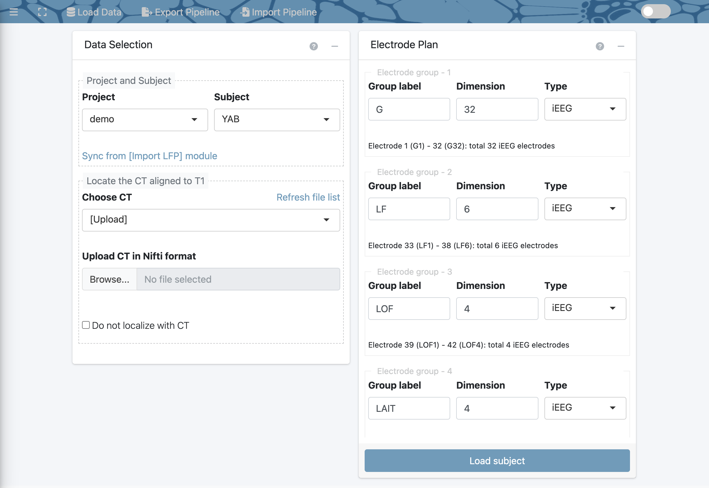

# Preprocessing 
<!-- will merge with 03 import data section that is already written--> 

The following steps will walk through the preprocessing of the raw iEEG signal data so that it can optimally be used in future analysis modules. The corresponding modules are:

(These must be done first, in order:)

* Notch Filter
* Wavelet
* Referencing

(These can be done after, in any order:)

* Surface Registration Localization
* Generate Epoch  

## Step #1: Import Signals 
<!-- not sure what would be the best name for these headers yet; want to imply the first four are sequential --> 
<!-- need to specify what type of data is being imported -- iEEG recording info) --> 

<!-- have labeled screenshot for each step similar to the one in 04-preprocessing--> 
This step involves importing iEEG data into RAVE so that it can be preprocessed and used in future modules.

**Step 1.1:** Select project & subject

First, use the drop down menu to **specify which project** the cleaned subject data will be stored in. To create a new project, select "New Project" from the drop down menu and indicate the desired project name. Note that by default, this project folder will be created within the `rave_data` folder of the data directory (`data_dir`), in a new folder for the subject. 

Next, use the drop down menu to **select the code for the subject** whose data to import. Note that a subject's data should be stored in its own folder within the raw directory (`raw_dir` folder) within the`rave_data` folder. 

Click the **"Create Subject"** button to proceed to the next step. 

**Step 1.2:** Format & session blocks

RAVE defines a block/session as a period of continuous electrode recording. Here, first **select the blocks** that correspond to the trials to analyze. 

Note that when a block is selected, a preview of the files it contains will pop-up to the right. This feature helps check that the way the data is stored is consistent with the file type selected. 

Then, **specify the file format** the iEEG data is stored in. RAVE currently supports four file formats: 

* .mat/.h5 file per electrode per block 
* single .mat/.h5 file per block 
* single EDF(+) file per block 
* single BrainVision file 

Note that when a format from the drop down is selected, a brief description of that specific format will pop-up underneath the menu. For more information on these file types, visit the Q&A at [Importing Data](#importing-data)

<!-- maybe cross link each of these file formats to a question in the Q&A session so that if someone wants to learn more about a given file format, they can do so without cluttering up this section. or should i give the description right next to the bullet point --> 

**Step 1.3:** Channel information

RAVE equates a channel to an electrode. Set the following specifications for the channels:  

<!-- this isn't exactly true, so come back later to fix definition --> 

* **Data file:** 

* **Channel numbers:** Indicate the electrodes to analyze. It is recommended that the preprocessing steps are run on all electrodes at once. Note that RAVE can automatically detect potential electrodes based on the specified blocks and file type; this suggestion is displayed at the bottom of the panel. 

* **Physical unit:** Indicate the units used to measure voltage.

* **Sample rate:** Indicate the rate of the iEEG recording equipment; this value will determine the rate at which the preprocessing will be run.

Now, select the **Validate & Import** button to validate your data. A pop-up will soon appear asking about readiness to import your data. Please double check all the information  entered is correct, and then select the **Import Data** button to proceed. A progress bar will appear in the bottom left corner. 

<!-- in this paragrraph, make sure to add a note about the skip validate & import button / when it can be used --> 

A pop-up will soon appear indicating that the subject data was successfully imported into RAVE! Now, use the menu on the left side of the screen to select the first preprocessing module, notch filter. 

## Step #2: Notch Filter
<!-- add very brief description of what this section is for first; essentially it filters out extra noise without disruption to the rest of the signal. it does this by minimizing signals within a narrow bandwidth; the rest of the signal is not disrupted because it's not in the bandwidth. a bandwidth is a range of frequencies within a band. a common reason for applying it is because EEG recording setups often include an amplifier. 
AC power grid in US is 60 Hz, issue is the EEG recording equipment will pick up on that and we don't want those signals because they're not from the brain, they're external. so the idea is to remove that data. stopband = a band of frequencies that are reduced by a filter. width is essentially the amount of frequencies --> 
<!-- how do you create notch filter? probably put brief explanation here and then have a question in Q&A where they can learn more with any outside links. "The easiest is to create a notch filter, which basically involves taking the FFT of the signal, zeroing out the Fourier coefficients at/around 50 Hz (best to use gentle slopes to minimize introducing artifacts resulting from sharp edges), then taking the inverse FFT."--> 
<!-- "calculation of multiples of a base frequency" -- why do you need to do multiples? --> 

**What is a notch filter?** A notch filter blocks a given frequency or a narrow range of frequencies (aka a "bandwidth") from a signal without affecting the rest of that signal. It is often used to minimize line noise interference in raw iEEG data, which helps ensure that future analyses only consider actual brain data. A common source of this interference is the amplifier used in recording set-ups to convert electrode signals into a form readable by the computer. This interference is commonly introduced at 60 Hz, since that is the standard frequency used in the North American electrical grid system. 

To apply the notch filter, RAVE performs a fast fourier transform (FFT) of the signal. To learn more about FFT, visit the Q&A section at [Notch Filter](#notch-filter).

<!-- https://terpconnect.umd.edu/~toh/spectrum/FourierFilter.html, https://towardsdatascience.com/fast-fourier-transform-937926e591cb --> 

To apply the notch filter to your data, follow the steps below. 

<!-- clarify block --> 

Begin in the **Data Selection** window to <u> specify which data to perform the notch filter on </u>. Use the drop down to indicate the desired project and subject. Note that pressing the **Sync from [Import LFP] module** link will automatically select the project and subject that was just imported in the Import Signals module. 

<!-- make sure to add in the Q&A what happens if you get errors in this case --> 

Proceed by selecting the **Load Subject** button. A new screen will load with three panels: Filter Settings, Inspection, and Notch. Refer to the following screenshot for guidance. 

**Filter Settings:** Begin my indicating the desired configurations for the **filter(s)**.

* <u>Base frequency</u> refers to the frequency introduced by the amplifier that should be removed. By default, this is set as 60 Hz as that is the frequency introduced by most iEEG amplifiers.  

* <u>x Times</u> sets the multipliers of the base frequency to remove by the filter. This feature accounts for harmonics (waves with frequencies that are positive integer multiples of the base frequency), which result because the signal from the amplifier is not a pure sine wave when undergoing FFT analysis. By default, this value is set as "1,2,3" based on the harmonics that commonly result in iEEG recording set-ups. This default means that 60 Hz (base frequency * 1), 120 Hz (base frequency * 2), 180 Hz (base frequency * 3) are the frequencies that the notch filter will remove. 

* <u>+- Bandwidth (Hz)</u> refers to how wide to make each filter; a higher number will remove a wider range of frequencies whereas a lower number will remove a narrower range of frequencies. Enter one number for each filter. By default, this value is set to 1,2,2 -- in other words, the filters will remove the bandwidths **59 - 61 Hz** (aka 60 Hz +/- 1), **118 - 122 Hz** (aka 120 Hz +/- 2), **178 - 182 Hz** (aka 180 Hz +/- 2) respectively. 

<!-- specify why they may wish to do this // how exactly do you wish to set it to this --> 

Based on these configurations, the bottom of the panel will automatically display a summary of how many filters there are and the bandwidths each will remove. 

Click the blue **Apply Notch Filters** button to apply the filters to the data. A pop-up will appear showing a summary of the configurations. Click "Confirm" to proceed. 

<!-- add transition --> 
<!-- add we can not find any imported electrode message on notch -- inspect signals screen --> 

**Inspection:** Controls settings of the figures displayed in the Notch: Inspect Signals panel located to the right. 

Use the <u>block</u> and <u>electrode</u> drop down menus to select the data to display in the Notch: Inspect Signals panel. You can use the `previous` and `next` buttons to easily switch between which electrode's data is displayed within a selected recording session.  

* The <u>window length</u> slider controls the power range displayed for the Welch periodograms. The more the slider is moved to the right, the wider the dB range on the y-axis. 

<!-- include by what amount changing the window length corrresponds to --> 

* The <u>frequency limit</u> slider controls the frequency range for the Welch periodograms. The more the slider is moved to the right, the higher the frequencies that will be displayed on the x-axis. 

* The <u>number of histogram bins</u> slider controls how wide the voltage ranges on the horizontal axis of the histogram are, where each bin represents a vertical bar on the graph. Choosing a larger number will create narrower voltage ranges and thus more vertical bars, whereas choosing a smaller number will create wider voltage ranges and thus fewer vertical bars. Moving the slider can give a more precise look at which voltages are most represented in the electrode signal. 

**Notch: Inspect Signals:** Displays **raw and filtered iEEG signals** for each channel whose data was imported. 

<!-- Refer to the following screenshot for further guidance. label purpose of each section --> 
<!-- note: they need to specify the configurations for the notch filter, and then --> 

* The top <u>Local Field Potential Graph</u> plots voltage versus time in seconds to show the raw signal that was recorded from the selected electrode. The red lines on the graph reflect the normalization.  

<!--what do the red lines indicate? // negative voltage -- current flow in opposite direction than potential difference // LFP a summation signal of excitatory and inhibitory dendritic potentials from a large number of neurons in the neighborhood of the recording site. --> 

* The leftmost <u>Welch Periodogram </u> estimates the power of the signal at its component frequencies. Before applying the notch filter, only the original graph will be shown in grey. After the notch filter has been applied, the filtered signal will be shown in red; it should visibly be evident thaat the the power of the signal is reduced at the base and harmonic frequencies. To learn more about the calculation of the Welch Periodogram, visit the Q&A at [Notch Filter](#notch-filter).

* The center <u>Welch Periodogram</u> is the same as the leftmost periodogram, except it is transformed to have a logarithmic x-axis. This graph makes viewing the signals at lower frequencies easier. 

* The <u>Histogram Original</u> plots frequency on the vertical axis and voltage on the horizontal axis to depict how often each range of voltages occurs in the signal. 

<!-- perhaps specify what each graph can be used for / purpose of changing the sliders -- e.g. number of histogram bins ... making it larger would allow for more precise look at which voltages are included in the siggnal --> 

To download these figures, simply click the **Download as PDF** link at the bottom of the Inspection panel. This will generate a PDF file in a new tab with a slide for each electrode within each block. 

<!-- add note that it is always possible to lose cerebral data with the filter --> 

Now, use the menu at left to proceed to the wavelet module! 

## Step #3: Wavelet

Once you click the wavelet tab on the left menu, a data selection window will appear to select the project and subject whose data to apply the wavelet decomposition to. (Remember clicking the "sync from [import LFP] module" will automatically select the subject that was just imported.) Note: The notch filter must have been applied to the selected subject before trying to apply the wavelet transformation.  

After selecting the "Load Subject" button, a new screen will load with two panels: Wavelet Settings and Wavelet Kernel. Refer to the following screenshot for guidance. 

Wavelet decomposition is a type of time frequency analysis that is used for non-stationary signals (i.e. properties change over time), like that of iEEG. It separates the signal into differing frequency and phase components, which is helpful because signals in the brain are very dynamic. This process makes it so that changes in the signal's power spectra can be visualized across both frequency and time. 

To learn more about how wavelet transform works, visit the Q&A at [Wavelet](#wavelet).

<!-- in Q&A compare to time analysis --> 

In this module, RAVE will: 
- downsample the signal before running the wavelet, if desired 
- run a wavelet on each block in the selected subject's folder 
- downsample the wavelet coefficients to 100.0 Hz to reduce the amount of space needed to save the information onto the computer's disk 

**Wavelet Settings:** 

<!-- why did you remove option to select electrodes like old version --> 
Begin by setting the basic configurations: 

* <u>Power sample rate</u> refers to the rate at which the signal will be taken into time frequency decomposition. By default, it is recommended to keep this set to the default 100 Hz; this balances the data so that precision is conserved without taking up too much space on the disk. Typically, this value should only be increased if neural signals will be analyzed at very high frequencies. (**Note:** this is _not_ the same as the signaling rate used in the iEEG recording set-up. For further explanation, see the Q&A at [Wavelet](#wavelet).)

<!-- double check above definition. wasn't sure best way to explain it -->

<!-- explain default; is this the same as the sample rate set in importing signals? --> 

* The <u>Down-sample before wavelet </u> drop down menu has the option to select a factor of 1, 2, 4, or 8 to use to reduce the sample rate. Reducing the sampling rate is done to run the wavelet transform faster and use less of the computer's disk space. Note that selecting 1 equates to no reduction in the sampling rate. Reducing the rate by a higher factor allows for analyzing a greater frequency range. 

<!-- list what it is set to by default; how do they know which number specifically to pick? or things to consider --> 

To further reduce the amount of time it takes to run the wavelet, please select the **use single float precision** checkbox. 

**Note:** Setting the down-sample value to 1 and leaving the box unchecked will preserve precision of the calculations and is appropriate if there are many hours available to run the wavelet. However, if quick processing of data is needed, such as in clinical situations, it is better to downsample and use single float precision. 

<!--  also explain why this increases speed --> 

Proceed by setting the frequency and cycle configurations: 

* The <u> select method to generate wavelet parameters </u> drop down menu determines **how** the configurations for the wavelet will be set. By default, it is set to **"built in"**, meaning that the frequency and cycle settings can be set manually on the RAVE interface (see bullet points below). Alternatively, selecting **"upload preset"** is commonly used to save time if one already has their own set configurations they want to use on the data. An upload button will appear; please upload the preset in the form of a csv with two columns for the frequency and cycles. Proceed straight to running the wavelet via the blue "run wavelet" button if a preset is uploaded. 

* Use the <u> frequency range </u> slider to select the range of frequencies that will be decomposed with the wavelet. 

* The value selected with the <u> frequency step size </u> slider depends on the frequency desired after the wavelet is performed. 

<!-- how to know what value to input for step size; be more specific in step size documentation --> 

* Use the <u> wavelet cycles </u> slider to choose the range of cycles to use in the transform. Note that a larger number of cycles will lead to more precise frequency analysis, whereas a smaller number of cycles will lead to more precise temporal analysis. 

**Wavelet Kernel:** 

The figures displayed on this panel visually display the properties of the wavelet given the selected configurations.  

* The <u> Wavelet Kernels (Real & Imaginary) </u> shows the kernel at given frequencies in Hz and times in seconds (aka wavelet length).

<!-- better define kernel in documentation and add more details to these graphs / describe trends--> 

* The <u> Wavelet Length | Frequency </u> graph plots the length of the kernel in seconds at different frequencies in Hz. 

<!-- explain what down log trend means // purpose of each graph --> 

* The <u> Wavelet Cycle | Frequency </u> graph plots the number of cycles for the wavelet at different frequencies in Hz. 

To download these figures, hover over the top left corner of the panel and a small, grey save icon will appear. Clicking on the icon will generate a pdf with the figures. 

To download the kernel parameters, click the blue **download kernel parameters** link at the bottom of the window. This will generate a csv file with each frequency and its corresponding number of cycles. To simply view the parameters on the interface, click anywhere on the panel and it will switch the view to display a table with the frequency and cycle data; click anywhere on this table to switch back to the figure view. (Alternatively, on figure view, click on the table icon in the top right corner of the panel.)

When finished setting the configurations and reviewing the figures, select the blue **Run Wavelet** button. As shown below, a pop-up will appear on the screen asking to confirm the subject, frequencies, # of cycles, and precision selected for the wavelet transformation. Click "confirm" to proceed, or "confirm and run in background to continue using RAVE during the decomposition process. Note that this process can take up to 30 minutes; progress bars for each task will be displayed in the lower right corner. 

The process is completed if a "success" pop-up appears. This means that the signal data for the electrodes within each of the subject's blocks have been down-sampled (if desired), decomposed by the wavelet into time-frequency data, and down-sampled again. 

Proceed to the next module, referencing! 

## Step #4: Reference Channels
Common average referencing 

After the four steps above have been completed, the remaining modules below can be done in any order: 

## Surface & Electrodes

The surface & electrodes section is composed of two modules: Reconstruction & Coregistration and Electrode Localization. 

<!-- add sentence summarizing overall purpose/goal of surface & electrodes section --> 

### Reconstruction & Coregistration

The Reconstruction & Coregistration module has three main goals: import raw magnetic resonance (MR) and computerized tomography (CT) images into RAVE, reconstruct a model of the subject's cortical surface, and align the imported MRI & CT images. These tasks are important to ensure proper running of the Electrode Localization module. 

There are two panels to note: Data settings and Command-line settings. Refer to the following screenshot for guidance. 

**Data Settings**: 

Start by using the <u> project and subject drop down menus </u> to select the subject whose MRI and CT images that will be imported. Once again, using the blue "sync project & subject from [Import LFP] module" link at the bottom of the panel will automatically select the project and subject that was just being worked on. 

Next, use the <u> MRI drop down menu </u> to select the **raw MRI image** for the selected subject. RAVE currently accepts two input types for MRI images: 

* **DICOM:** submit a folder of DICOM files, representing a series of 2D brain slices
* **Nifti:** submit a single Nifti file representing the full 3D brain scan (e.g. subject_MRI.nii)

<!-- outdated: Note: Select the checkbox "Skip the FreeSurfer Reconstruction" if reconstructing the subject's cortical surface model is not necessary. By default, this box will be checked.--> 

Then, use the <u> Raw CT DICOM folder </u> drop down menu to select the **raw CT image** for the selected subject. Your input should be a **DICOM folder**. 

<!-- double check ... can it also be a nifti file? what about with the YCQ subject I have that has a folder with .nii files? --> 

<!-- outdated: Note: Select the checkbox "Skip the CT Co-Registration" if it is not desired to align and overlay the subject's CT scan with their MRI image. By default, this will be unchecked because aligning/overlaying this data allows for the accurate localization of electrodes. --> 

For more information on these file formats, visit the Q&A at [Reconstruction & Coregistration](#Reconstruction&Coregistration).
<!-- maybe add a question on the file formats, but also more info about what co-registration iss --> 

Then, proceed to the command-line settings panel.  

<!-- if you select a nii file, then it doesn't need to be converted to nifti format, so does RAVE just skip the dcm2niix command? --> 

**Command-line settings**: 

The following steps will involve the computer's <u> command-line interface. </u> (On Mac, this refers to the Terminal. On Windows, it refers to Command Prompt.) RAVE requires the use of the external programs `dcm2niix` and `FreeSurfer`, and then either `FSL` or `AFNI.` This panel simply confirms whether the programs were downloaded by displaying the location of the program on the computer. If the file path is **not** automatically filled in for `dcm2niix`, `FreeSurfer`, and your choice of `FSL` or `AFNI`, please return to the installation guide at [Install External Programs](#install-external-programs-dcm2niix-freesurfer-fsl-afni) and follow the steps to download the missing software. Descriptions of what these programs do are also available in the installation guide. 

Now, click the blue **Check data and command-line tools** button. A pop-up will appear confirming the MRI/CT inputs and what tasks will be completed using the external programs. Please also pay attention to any warnings that will be listed (e.g. if RAVE can not find FSL-flirt, if there is an existing `FreeSurfer` reconstruction for a subject). In particular, warnings that say "the script will fail/error" should **not** be ignored, as that indicates some tasks will can not be completed. (For help resolving common warnings, visit the Q&A at [Reconstruction & Coregistration](#reconstruction-coregistration-1).) When ready, hit "proceed". 

The following screen will appear, with four panels: Subject Information, Import DICOM Images, Surface Reconstruction, and Co-Registration CT to T1. Refer to the following screenshot for guidance. 

**Subject Information:**  The project and subject whose MRI and CT data is currently being used will be displayed here. A task list will also be displayed. By default, three tasks will be listed: 1). Convert `.dcm` images to `.nii`, 2). Surface reconstruction, and 3). CT co-registration.

**Import DICOM Images:** Begin here to convert MRI and CT DICOM images to the `Nifti` format using the `dcm2niix` external library. The `Nifti` format will be used by `FreeSurfer` and `FSL`/`AFNI` in later steps. Press on the "+" sign in the right corner of the panel to expand the view. 

>Note: This script requires the Unix `bash` terminal in order to run commands read from the command-line interface. If using a Mac, this should already be provided. If using Windows, please install the Linux sub-system (WSL2). 

Specify the following configurations using the drop-down menu: 

* **Merge 2D slices from same series regardless of echo, exposure, etc:** Select "yes" to force stacking of the slices. Select "no" to separate images according to their echo (MRI), study times, exposure level (CT), orientation, etc for reasons such as preserving contrast. Select "auto" for `dcm2niix` to automatically decide whether to merge based on the image modality (i.e. MRI vs CT). Note that merging will consolidate slices from the series into one `Nifti` file, whereas merging can generate multiple `Nifti` files. 

* **Crop 3D acquisitions:** Select "yes" to remove excess air as well as neck tissue from the 3D acquisitions. Select "no" if this is not necessary. Select "ignore" for images to be neither cropped nor rotated to the nearest orthogonal direction to canonical space (e.g. for non-anatomical scans). 

Based on these configurations, a series of commands will be automatically generated in the greyspace below. Click the sideways black triangles at the bottom left of the panel to view these commands. Note that there are separate series of commands for the MRI and CT images. 

>Note: The grey text represents comments. The purple texts are the actual commands that will be run by the computer. 

RAVE provides the choice of copying these commands and running them on the computer's command-line interface manually. This is recommended as other RAVE features can still be used while the commands run in the background, which is especially helpful if the commands will take a long time. Select the blue "save & run by yourself" button; a pop-up will appear and pressing the greyspace will automatically copy the commands. 

Alternatively, RAVE can run the commands directly. Simply select the grey "Run from RAVE (T1 MRI)". A pop-up will appear indicating when `dcm2niix` has finished converting the MRI images from the DICOM to Nifti format (note that if the MRI file was already in the Nifti format, RAVE will simply make a copy of that file). Then, select the "Run from RAVE (CT)" button to repeat this process with the CT image. These processes usually take a few seconds. 

**The resulting Nifti MRI and CT files will be stored in an `inputs` folder within the subject's `rave-imaging` folder.** 

**Surface Reconstruction:**

This panel reconstructs a subject's cortical surface using `FreeSurfer` and the `Nifti` MRI file.    
>Note: This script requires the Unix `bash` terminal in order to run commands read from the command-line interface. If using a Mac, this should already be provided. If using Windows, please install the Linux sub-system (WSL2) 

Start by selecting the `Nifti` **MRI File** desired. (The blue "refresh" link can be pressed to update the drop-down if changes have recently been made to the subject's folder.) Next, select the **recon flag**, which refers to which `FreeSurfer` steps are desired for the reconstruction of the brain model. Visit the [FreeSurfer website](https://surfer.nmr.mgh.harvard.edu/fswiki/recon-all) to learn more about the seven choices. Use the drop-down menu on RAVE to select the recon flag that is fitting for the project. A screenshot has been included below for convenience indicating the steps each flag includes:

> Note: Most flags can take several hours for the computer to run. If the quickest flag is desired, select **-autorecon1** in the drop-down menu; it includes minimal steps and so only takes 10 minutes to run. 

Proceed to the "Remove existing work before running the command (if applicable)" checkbox. Selecting the box is appropriate if the subject's cortical surface was already partially or fully reconstructed and it is desired to start anew (e.g. if an error resulted due to a licensing issue). By default, this will be unchecked. 

<!-- label for terminal script doesn't update based on flag for some reason --> 

Commands will be generated in the greyspace below. Click on the black triangle at the bottom of the panel to view the commands. Once again, to run them manually, click the blue "Save & run by yourself" button. To have RAVE invoke system command, select the "Run from RAVE" button. 

A pop-up will appear indicating when the process is completed; at that point, **outputs will have been stored in a newly created `fs` folder in the subject's rave-imaging folder.** 

<!-- what does "scripts" file in rave imaging store? does it automatically store the command-line scripts used --> 

<!-- specify outputs of each; what are outputs -->  

**Co-Registration CT to T1:**

This panel will align and overlay (aka "co-register") the subject's MRI & CT images using either `FSL` or `AFNI.` 

>Note: This script requires the Unix `bash` terminal in order to run commands read from the command-line interface. If using a Mac, this should already be provided. If using Windows, please install the Linux sub-system. 

Use the drop down menu to select the **CT file**. (The blue "refresh" link can be pressed to update the drop-down if changes have recently been made to the subject's folder.) Then use the **program** drop down to specify whether `FSL` or `AFNI` will be used. 

Click the black triangle on the bottom of the panel to display the commands. Once again, select the appropriate button based on whether the commands will be run manually or through RAVE. Note that this process takes around 30 minutes; a pop-up will indicate when it is finished. **The output will be a single `ct_in_t1.nii.gz` file representing the CT scan co-registered with the MRI image. The file is stored in the `coregistration` folder within the subject's `rave-imaging` folder.** 

Now, proceed to the electrode localization module to begin identifying electrodes! 

### Electrode Localization

RAVE's electrode localization module features a built-in 3D viewer and allows for the quick and precise identification of where in the brain electrodes are located. The module is based on the co-registered image of the CT and MRI scans, as well as the reconstruction of the subject's cortical surface via the MRI scan. 

<!-- add: Users are able to _______, label electrodes, and form groups. like expand on features -- able to view on screen --> 

When the electrode localization module is selected, two panels will appear on the screen: Data Selection & Electrode Plan. Refer to the following screenshot for guidance.  

<!-- describe what electrode localization even is --> 

**Data Selection:** 

Begin in the data selection panel at left. Use the **project and subject drop down menus** to select the subject whose electrodes you wish to localize. You can once again use the "Sync from [Import LFP] module" to automatically select the project and subject that was just imported. 

Next, use the drop down menu in **choose CT aligned to T1** to select the `Nifti` file representing the co-registered CT and MRI scans (e.g. `ct_in_t1.nii` that was generated in the previous module). It is alternatively possible to directly upload a co-registered `Nifti` file by selecting the "upload" option and resulting "browse" button. Note that if changes have been made to the file directory, selecting the blue "refresh file list" link will update the drop down menu. 

If it is preferred <u> not </u> to localize with the CT image (such as in cases where a CT scan is not yet available), select the checkbox "Do not localize with CT." The subject's MRI image will be used in lieu. By default, this will be unchecked as using a co-registered CT and MRI image allows for more precise localization of electrodes. 

Proceed to the Electrode Plan panel. 

**Electrode Plan:** 

This panel allows for the creation of **groups** to provide a more organized way to localize a subject's electrodes. 

As many or as few groups can be created as desired. Scroll to the bottom of the panel to use the **plus button** to add a new group, or the **minus button** to delete the bottom-most group. 

For each group, specify the: 

* **Label:** the desired name for the group.

* **Dimension:** the number of electrodes within the group. 

> Note: For electrode groups placed in a grid, it is recommended to input the dimensions in the format "number x number," e.g. "8x4", rather than specifying a whole number total, e.g. 32. Using this format can help automatically set the 3D viewer's configurations for easier localization of electrodes. 

* **Type:** the type of exam the electrodes came from. Select from electroencephalogram (EEG), intracranial EEG (iEEG), stereotactic EEG (sEEG), ElectroCochleoGraphy (ECoG), or "other". 

Note that for each group, a summary will be displayed to indicate the individual electrode labels (e.g. G1 - G32), as well as total number of electrodes. 

When the groups are ready, click the blue **Load Subject** button to proceed. If there are any errors, a pop-up will appear indicating the error and a recommended fix (e.g. "invalid CT file. Please specify or upload your own.") If there are no errors, a "loading in progress" pop-up will appear indicating that the coregistered file and 3D viewer are being loaded. This process can take a few minutes. 

Once finished, the 3D viewer screen will automatically appear, with two panels: Localization Plan Details and Interactive 3D Viewer. Refer to the following screenshot for guidance: 

Look at the **Localization Plan Details** panel on the left, which displays the groups created on the previous screen. Begin by selecting a group to localize its electrodes. A table will appear with a row for each electrode in the group and columns specifying each electrode's label, tkrRAS location, MNI152, and FSLabel. 

tkrRAS is a surface coordinate system used by FreeSurfer, where R orients toward the right direction, A orients toward the anterior direction, and S orients toward the superior direction. By default, these values will be set to 0,0,0. MNI152 is a volumetric coordinate system derived from averaging 152 individuals' MRI scans. By default, these values will be empty. (To learn more about these coordinate systems, visit the Q&A at [Electrode Localization](#electrode-localization-1).) FSLabel corresponds to ________. By default, these values will be empty. 

Now, click on the **Show/Hide Localization Instructions** button at the bottom of the panel for guidance on how to use the 3D viewer to localize the selected group's electrodes. 

The right panel contains the **3D Viewer,** which consists of the subject's reconstructed brain model shown in black/white and their electrodes shown in green. Use the computer's mousepad to zoom in and out of the model. 

There are various settings for the viewer that can be changed using the black box at right: 

**Default Settings:** 

* <u> Background color: </u> change the background color of the viewer. 

* <u> Record (chrome-on): </u> clicking here will start recording the 3D viewer and clicking again will stop the recording. A video in the .webm format will automatically download to the computer. This feature can be used to generate a video of the localization process. 

* <u> Screenshot: </u> click here to take a screenshot of the current image in the 3D viewer. A .pdf file containing the image will automatically download to the computer. 

* <u> Reset: </u> reset the brain model to its default position.  

* <u> Camera position: </u> use the drop-down to change the view of the brain from the default `free rotate ` (change orientation freely by dragging the cursor) to `[lock]` (preserve current orientation), `right`, `left`, `anterior`, `posterior`, `superior`, or `inferior`.   

* <u>Display coordinates: </u> enabling this checkbox will display the tkRAS coordinate plane in the bottom left corner of the viewer. 

**Volume Settings:** 

**Surface Settings:** 

**Electrodes:** 

**Electrode Localization:** 

**Data Visualization:** 

**Interactive 3D Viewer:** 

<!-- how/why do people usually group the electrodes? e.g. by location? by type? because it makes it easier for analysis? --> 

<!-- can someone have no groups --> 

<!-- instead of other, can they type in what they want? look into difference between types --> 

<!-- specify that selecting "load subject" can switch to fix the groups --> 
## Generate Epoch 

<!-- add general overview -- what does it mean to generate epochs --> 

When the Generate Epoch module is first selected, a data selection window will appear. Simply select the project and subject whose data will be used. Once again, selecting "Sync from [Import LFP] module" will automatically select the project and subject that was just imported. Click the blue "Load Subject" button to proceed. 

Three panels will then appear on the screen: Load Epoch Channel and Transform & Threshold on the left side, and Interactive Selector on the right side. Refer to the following screenshot for guidance.  

* **Load Epoch Channel:** 

** Load existing epoch: 

** Choose a block to generate epoch: 

** File containing epoch channel: 

Then, click the blue **"Load Epoch File"** button to proceed. 

The next two fields will specify the channel settings. <!-- be more specific --> 

** Variable Name: 

** Epoch Channel Sample Rate:  <!-- i believe this is the same as voltage recording rate, i.e. the 2000? --> 

* **Transform & Threshold:** 

** Plot range: 

Two checkboxes: Difference Plot & Absolute Plot 

** Threshold direction: 

** Minimum duration (s): 

* **Interactive Selector:** 

** Graphical Visualization: 

** Threshold results: 

To **download the staged table,** click the blue link in the bottom right corner of the panel. Note that the file will be saved to the subject's meta folder within the 

<!-- no error message when you try to load subject but it doesn't work ... what is wrong? --> 
