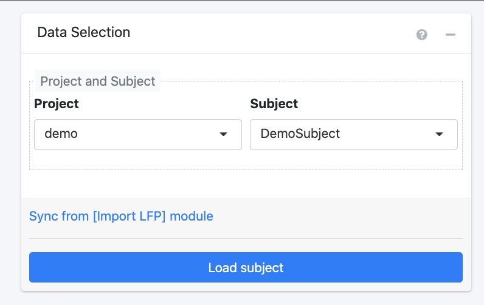

--- 
title: "RAVE Documentation"
author: ""
date: "`r Sys.Date()`"
site: bookdown::bookdown_site
documentclass: book
bibliography: [book.bib, packages.bib]
biblio-style: "apalike"
# url: your book url like https://bookdown.org/yihui/bookdown
# cover-image: path to the social sharing image like images/cover.jpg
description: |
  RAVE documentation
link-citations: yes
github-repo: beauchamplab/rave-documentation
---

# url: your book url like https://bookdown.org/yihui/bookdown

Placeholder

## Showcases {-}

<!--chapter:end:index.Rmd-->

# Installation Guide

Placeholder

## System Prerequisites
### Linux -->
### MacOS
## Install RAVE
## Download demo data 
## Upgrade RAVE
## Troubleshooting 

<!--chapter:end:02-installation.md-->

# Get Started

Placeholder

## Overview of RAVE Structure 
## Starting and Closing RAVE

<!--chapter:end:03-get-started.md-->

# Get Data into RAVE

Placeholder

## File hierarchy and specification
## Overview: Voltage data
### Format 1
## Importing demo data
### Step 1: Select Subject
### Step 2: Select Project or Create New One 
### Step 3: Validate Data 
## Importing Your Own Data
### Organizing Your Directories 

<!--chapter:end:04-import-data.Rmd-->

# Preprocessing 
<!-- will merge with 03 import data section that is already written--> 

The following steps will walk through the preprocessing of the raw iEEG signal data so that it can optimally be used in future analysis modules. The corresponding modules are:

(These must be done first, in order:)

* Notch Filter
* Wavelet
* Referencing

(These can be done after, in any order:)

* Surface Registration Localization
* Generate Epoch  

## Step #1: Import Signals 
<!-- not sure what would be the best name for these headers yet; want to imply the first four are sequential --> 
<!-- need to specify what type of data is being imported -- iEEG recording info) --> 

<!-- have labeled screenshot for each step similar to the one in 04-preprocessing--> 
This step involves importing iEEG data into RAVE so that it can be preprocessed and used in future modules.

**Step 1.1:** Select project & subject

First, use the drop down menu to **specify which project** the cleaned subject data will be stored in. To create a new project, select "New Project" from the drop down menu and indicate the desired project name. Note that by default, this project folder will be created within the `rave_data` folder of the data directory (`data_dir`), in a new folder for the subject. 

Next, use the drop down menu to **select the code for the subject** whose data to import. Note that a subject's data should be stored in its own folder within the raw directory (`raw_dir` folder) within the`rave_data` folder. 

Click the **"Create Subject"** button to proceed to the next step. 

**Step 1.2:** Format & session blocks

RAVE defines a block/session as a period of continuous electrode recording. Here, first **select the blocks** that correspond to the trials to analyze. 

Note that when a block is selected, a preview of the files it contains will pop-up to the right. This feature helps check that the way the data is stored is consistent with the file type selected. 

Then, **specify the file format** the iEEG data is stored in. RAVE currently supports four file formats: 

* .mat/.h5 file per electrode per block 
* single .mat/.h5 file per block 
* single EDF(+) file per block 
* single BrainVision file 

Note that when a format from the drop down is selected, a brief description of that specific format will pop-up underneath the menu. For more information on these file types, visit the Q&A at [Importing Data](#importing-data)

<!-- maybe cross link each of these file formats to a question in the Q&A session so that if someone wants to learn more about a given file format, they can do so without cluttering up this section. or should i give the description right next to the bullet point --> 

**Step 1.3:** Channel information

RAVE equates a channel to an electrode. Set the following specifications for the channels:  

<!-- this isn't exactly true, so come back later to fix definition --> 

* **Data file:** 

* **Channel numbers:** Indicate the electrodes to analyze. It is recommended that the preprocessing steps are run on all electrodes at once. Note that RAVE can automatically detect potential electrodes based on the specified blocks and file type; this suggestion is displayed at the bottom of the panel. 

* **Physical unit:** Indicate the units used to measure voltage.

* **Sample rate:** Indicate the rate of the iEEG recording equipment; this value will determine the rate at which the preprocessing will be run.

Now, select the **Validate & Import** button to validate your data. A pop-up will soon appear asking about readiness to import your data. Please double check all the information  entered is correct, and then select the **Import Data** button to proceed. A progress bar will appear in the bottom left corner. 

<!-- in this paragrraph, make sure to add a note about the skip validate & import button / when it can be used --> 

A pop-up will soon appear indicating that the subject data was successfully imported into RAVE! Now, use the menu on the left side of the screen to select the first preprocessing module, notch filter. 

## Step #2: Notch Filter
<!-- add very brief description of what this section is for first; essentially it filters out extra noise without disruption to the rest of the signal. it does this by minimizing signals within a narrow bandwidth; the rest of the signal is not disrupted because it's not in the bandwidth. a bandwidth is a range of frequencies within a band. a common reason for applying it is because EEG recording setups often include an amplifier. 
AC power grid in US is 60 Hz, issue is the EEG recording equipment will pick up on that and we don't want those signals because they're not from the brain, they're external. so the idea is to remove that data. stopband = a band of frequencies that are reduced by a filter. width is essentially the amount of frequencies --> 
<!-- how do you create notch filter? probably put brief explanation here and then have a question in Q&A where they can learn more with any outside links. "The easiest is to create a notch filter, which basically involves taking the FFT of the signal, zeroing out the Fourier coefficients at/around 50 Hz (best to use gentle slopes to minimize introducing artifacts resulting from sharp edges), then taking the inverse FFT."--> 
<!-- "calculation of multiples of a base frequency" -- why do you need to do multiples? --> 

**What is a notch filter?** A notch filter blocks a given frequency or a narrow range of frequencies (aka a "bandwidth") from a signal without affecting the rest of that signal. It is often used to minimize line noise interference in raw iEEG data, which helps ensure that future analyses only consider actual brain data. A common source of this interference is the amplifier used in recording set-ups to convert electrode signals into a form readable by the computer. This interference is commonly introduced at 60 Hz, since that is the standard frequency used in the North American electrical grid system. 

To apply the notch filter, RAVE performs a fast fourier transform (FFT) of the signal. To learn more about FFT, visit the Q&A section at [Notch Filter](#notch-filter).

<!-- https://terpconnect.umd.edu/~toh/spectrum/FourierFilter.html, https://towardsdatascience.com/fast-fourier-transform-937926e591cb --> 

To apply the notch filter to your data, follow the steps below. 

<!-- clarify block --> 

Begin in the **Data Selection** window to <u> specify which data to perform the notch filter on </u>. Use the drop down to indicate the desired project and subject. Note that pressing the **Sync from [Import LFP] module** link will automatically select the project and subject that was just imported in the Import Signals module. 

<!-- make sure to add in the Q&A what happens if you get errors in this case --> 

Proceed by selecting the **Load Subject** button. A new screen will load with three panels: Filter Settings, Inspection, and Notch. Refer to the following screenshot for guidance. 

**Filter Settings:** Begin my indicating the desired configurations for the **filter(s)**.

* <u>Base frequency</u> refers to the frequency introduced by the amplifier that should be removed. By default, this is set as 60 Hz as that is the frequency introduced by most iEEG amplifiers.  

* <u>x Times</u> sets the multipliers of the base frequency to remove by the filter. This feature accounts for harmonics (waves with frequencies that are positive integer multiples of the base frequency), which result because the signal from the amplifier is not a pure sine wave when undergoing FFT analysis. By default, this value is set as "1,2,3" based on the harmonics that commonly result in iEEG recording set-ups. This default means that 60 Hz (base frequency * 1), 120 Hz (base frequency * 2), 180 Hz (base frequency * 3) are the frequencies that the notch filter will remove. 

* <u>+- Bandwidth (Hz)</u> refers to how wide to make each filter; a higher number will remove a wider range of frequencies whereas a lower number will remove a narrower range of frequencies. Enter one number for each filter. By default, this value is set to 1,2,2 -- in other words, the filters will remove the bandwidths **59 - 61 Hz** (aka 60 Hz +/- 1), **118 - 122 Hz** (aka 120 Hz +/- 2), **178 - 182 Hz** (aka 180 Hz +/- 2) respectively. 

<!-- specify why they may wish to do this // how exactly do you wish to set it to this --> 

Based on these configurations, the bottom of the panel will automatically display a summary of how many filters there are and the bandwidths each will remove. 

Click the blue **Apply Notch Filters** button to apply the filters to the data. A pop-up will appear showing a summary of the configurations. Click "Confirm" to proceed. 

<!-- add transition --> 
<!-- add we can not find any imported electrode message on notch -- inspect signals screen --> 

**Inspection:** Controls settings of the figures displayed in the Notch: Inspect Signals panel located to the right. 

Use the <u>block</u> and <u>electrode</u> drop down menus to select the data to display in the Notch: Inspect Signals panel. You can use the `previous` and `next` buttons to easily switch between which electrode's data is displayed within a selected recording session.  

* The <u>window length</u> slider controls the power range displayed for the Welch periodograms. The more the slider is moved to the right, the wider the dB range on the y-axis. 

<!-- include by what amount changing the window length corrresponds to --> 

* The <u>frequency limit</u> slider controls the frequency range for the Welch periodograms. The more the slider is moved to the right, the higher the frequencies that will be displayed on the x-axis. 

* The <u>number of histogram bins</u> slider controls how wide the voltage ranges on the horizontal axis of the histogram are, where each bin represents a vertical bar on the graph. Choosing a larger number will create narrower voltage ranges and thus more vertical bars, whereas choosing a smaller number will create wider voltage ranges and thus fewer vertical bars. Moving the slider can give a more precise look at which voltages are most represented in the electrode signal. 

**Notch: Inspect Signals:** Displays ***raw and filtered iEEG signals** for each channel whose data was imported. 

<!-- Refer to the following screenshot for further guidance. label purpose of each section --> 
<!-- note: they need to specify the configurations for the notch filter, and then --> 

* The top <u>Local Field Potential Graph</u> plots voltage versus time in seconds to show the raw signal that was recorded from the selected electrode. The red lines on the graph reflect the normalization.  

<!--what do the red lines indicate? // negative voltage -- current flow in opposite direction than potential difference // LFP a summation signal of excitatory and inhibitory dendritic potentials from a large number of neurons in the neighborhood of the recording site. --> 

* The leftmost <u>Welch Periodogram </u> estimates the power of the signal at its component frequencies. Before applying the notch filter, only the original graph will be shown in grey. After the notch filter has been applied, the filtered signal will be shown in red; it should visibly be evident thaat the the power of the signal is reduced at the base and harmonic frequencies. To learn more about the calculation of the Welch Periodogram, visit the Q&A at [Notch Filter](#notch-filter).

* The center <u>Welch Periodogram</u> is the same as the leftmost periodogram, except it is transformed to have a logarithmic x-axis. This graph makes viewing the signals at lower frequencies easier. 

* The <u>Histogram Original</u> plots frequency on the vertical axis and voltage on the horizontal axis to depict how often each range of voltages occurs in the signal. 

<!-- perhaps specify what each graph can be used for / purpose of changing the sliders -- e.g. number of histogram bins ... making it larger would allow for more precise look at which voltages are included in the siggnal --> 

To download these figures, simply click the **Download as PDF** link at the bottom of the Inspection panel. This will generate a PDF file in a new tab with a slide for each electrode within each block. 

<!-- add note that it is always possible to lose cerebral data with the filter --> 

Now, use the menu at left to proceed to the wavelet module! 

## Step #3: Wavelet

Once you click the wavelet tab on the left menu, a data selection window will appear to select the project and subject whose data to apply the wavelet decomposition to. (Remember clicking the "sync from [import LFP] module" will automatically select the subject that was just imported.) Note: The notch filter must have been applied to the selected subject before trying to apply the wavelet transformation.  

After selecting the "Load Subject" button, a new screen will load with two panels: Wavelet Settings and Wavelet Kernel. Refer to the following screenshot for guidance. 

Wavelet decomposition is a type of time frequency analysis that is used for non-stationary signals (i.e. properties change over time), like that of iEEG. It separates the signal into differing frequency and phase components, which is helpful because signals in the brain are very dynamic. This process makes it so that changes in the signal's power spectra can be visualized across both frequency and time. 

To learn more about how wavelet transform works, visit the Q&A at [Wavelet](#wavelet).

<!-- in Q&A compare to time analysis --> 

In this module, RAVE will: 
- downsample the signal before running the wavelet, if desired 
- run a wavelet on each block in the selected subject's folder 
- downsample the wavelet coefficients to 100.0 Hz to reduce the amount of space needed to save the information onto the computer's disk 

**Wavelet Settings:** 

<!-- why did you remove option to select electrodes like old version --> 
Begin by setting the basic configurations: 

* <u>Power sample rate</u> refers to the rate at which the signal will be taken into time frequency decomposition. By default, it is recommended to keep this set to the default 100 Hz; this balances the data so that precision is conserved without taking up too much space on the disk. Typically, this value should only be increased if neural signals will be analyzed at very high frequencies. (**Note:** this is _not_ the same as the signaling rate used in the iEEG recording set-up. For further explanation, see the Q&A at [Wavelet](#wavelet).)

<!-- double check above definition. wasn't sure best way to explain it -->

<!-- explain default; is this the same as the sample rate set in importing signals? --> 

* The <u>Down-sample before wavelet </u> drop down menu has the option to select a factor of 1, 2, 4, or 8 to use to reduce the sample rate. Reducing the sampling rate is done to run the wavelet transform faster and use less of the computer's disk space. Note that selecting 1 equates to no reduction in the sampling rate. Reducing the rate by a higher factor allows for analyzing a greater frequency range. 

<!-- list what it is set to by default; how do they know which number specifically to pick? or things to consider --> 

To further reduce the amount of time it takes to run the wavelet, please select the **use single float precision** checkbox. 

**Note:** Setting the down-sample value to 1 and leaving the box unchecked will preserve precision of the calculations and is appropriate if there are many hours available to run the wavelet. However, if quick processing of data is needed, such as in clinical situations, it is better to downsample and use single float precision. 

<!--  also explain why this increases speed --> 

Proceed by setting the frequency and cycle configurations: 

* The <u> select method to generate wavelet parameters </u> drop down menu determines **how** the configurations for the wavelet will be set. By default, it is set to **"built in"**, meaning that the frequency and cycle settings can be set manually on the RAVE interface (see bullet points below). Alternatively, selecting **"upload preset"** is commonly used to save time if one already has their own set configurations they want to use on the data. An upload button will appear; please upload the preset in the form of a csv with two columns for the frequency and cycles. Proceed straight to running the wavelet via the blue "run wavelet" button if a preset is uploaded. 

* Use the <u> frequency range </u> slider to select the range of frequencies that will be decomposed with the wavelet. 

* The value selected with the <u> frequency step size </u> slider depends on the frequency desired after the wavelet is performed. 

<!-- how to know what value to input for step size; be more specific in step size documentation --> 

* Use the <u> wavelet cycles </u> slider to choose the range of cycles to use in the transform. Note that a larger number of cycles will lead to more precise frequency analysis, whereas a smaller number of cycles will lead to more precise temporal analysis. 

**Wavelet Kernel:** 

The figures displayed on this panel visually display the properties of the wavelet given the selected configurations.  

* The <u> Wavelet Kernels (Real & Imaginary) </u> shows the kernel at given frequencies in Hz and times in seconds (aka wavelet length).

<!-- better define kernel in documentation and add more details to these graphs / describe trends--> 

* The <u> Wavelet Length | Frequency </u> graph plots the length of the kernel in seconds at different frequencies in Hz. 

<!-- explain what down log trend means // purpose of each graph --> 

* The <u> Wavelet Cycle | Frequency </u> graph plots the number of cycles for the wavelet at different frequencies in Hz. 

To download these figures, hover over the top left corner of the panel and a small, grey save icon will appear. Clicking on the icon will generate a pdf with the figures. 

To download the kernel parameters, click the blue **download kernel parameters** link at the bottom of the window. This will generate a csv file with each frequency and its corresponding number of cycles. To simply view the parameters on the interface, click anywhere on the panel and it will switch the view to display a table with the frequency and cycle data; click anywhere on this table to switch back to the figure view. (Alternatively, on figure view, click on the table icon in the top right corner of the panel.)

When finished setting the configurations and reviewing the figures, select the blue **Run Wavelet** button. As shown below, a pop-up will appear on the screen asking to confirm the subject, frequencies, # of cycles, and precision selected for the wavelet transformation. Click "confirm" to proceed, or "confirm and run in background to continue using RAVE during the decomposition process. Note that this process can take up to 30 minutes; progress bars for each task will be displayed in the lower right corner. 

The process is completed if a "success" pop-up appears. This means that the signal data for the electrodes within each of the subject's blocks have been down-sampled (if desired), decomposed by the wavelet into time-frequency data, and down-sampled again. 

Proceed to the next module, referencing! 

## Step #4: Reference Channels
Common average referencing 

--- 
After the four steps above have been completed, the remaining modules below can be done in any order: 

## Surface & Electrodes

The surface & electrodes section is composed of two modules: 

<!-- add sentence summarizing overall purpose/goal of surface & electrodes section --> 

### Surface & Registration

The Surface & Registration module has the goal of importing raw magnetic resonance (MR) and computerized tomography (CT) images into RAVE, so that they can be used in future analyses. There are two panels to note: Data settings and Command-line settings. Refer to the following screenshot for guidance. 

**Data Settings**: 

Start by using the <u> project and subject drop down menus </u> to select the subject whose MRI and CT images that will be imported. Once again, using the blue "sync project & subject from [Import LFP] module" link at the bottom of the panel will automatically select the project and subject that was just being worked on. 

Next, use the <u> MRI drop down menu </u> to select the **raw MRI image** for the selected subject. RAVE currently accepts two input types for MRI images: 

* **DICOM:** submit a folder of DICOM files, representing a series of 2D brain slices (e.g. ______)
* **Nifti:** submit a single Nifti file representing the full 3D brain scan (e.g. subject_MRI.nii)

> Note: Select the checkbox "Skip the FreeSurfer Reconstruction" if reconstructing the subject's cortical surface model is not necessary. By default, this box will be checked.

<!-- explain why it's checked by default --> 

Similarly, use the <u> Raw CT DICOM folder </u> drop down menu to select the **raw CT image** for the selected subject. Your input should be a **DICOM folder** ()

<!-- double check ... what if you just have nifti --> 

> Note: Select the checkbox "Skip the CT Co-Registration" if it is not desired to align and overlay the subject's CT scan with their MRI image. By default, this will be unchecked because aligning/overlaying this data allows for precise electrode localization. 

For more information on these file formats, visit the Q&A at [Surface&Registration](#Surface&Registration).
<!-- maybe add a question on the file formats, but also more info about what co-registration iss --> 

Then, proceed to the command-line settings panel.  

<!-- if you select a nii file, then it doesn't need to be converted to nifti format, so does RAVE just skip the dcm2niix command? --> 

<!-- any way to upload images for each subject in bulk? -->

**Command-line settings**: 

<!-- the general idea is that after specifying some configurations, this program will generate some command lines that the user should run on their own terminal to undergo the import process --> 

### Electrode Localization

When the electrode localization tab is selected from the RAVE module menu at left, two panels will appear on the screen: Data Selection & Electrode Plan. Refer to the following screenshot for guidance.  

<!-- describe what electrode localization even is --> 

**Data Selection:** 

Begin in the data selection panel at left. Use the <u> project and subject drop down menus </u> to select the subject whose electrodes you wish to localize. You can once again use the "Sync from [Import LFP] module" to automatically select the project and subject you were just working on. 

**Electrode Plan:** 

--- 

## Generate Epoch 

<!--chapter:end:05-preprocessing.Rmd-->

# Q&As

Placeholder

## Installation
## Getting Started with RAVE
## Downloading Demo Data 
## Importing Data
## Notch Filter
## Wavelet
## Surface & Registration
## Electrode Localization

<!--chapter:end:99-QA.Rmd-->

